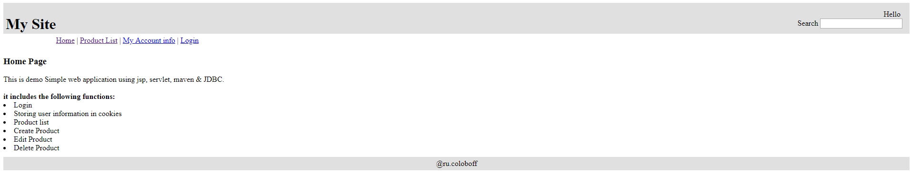

Web Simple application. The web project involves the technology: Maven. J2EE: JSP and servlet. JDBC. 
The web application includes the following functions: <li>Login</li>
                                                          <li>Storing user information in cookies</li>
                                                          <li>Product list</li>
                                                          <li>Create Product</li>
                                                          <li>Edit Product</li>
                                                          <li>Delete Product</li> 
                                                            
<h4>Pages web app</h4>
<em>Home page list:</em>

 
<em>Add roduct list page: </em>

 
<em>Product list page:</em>

 
<em>Login page:</em>

 
<em>Info account page:</em>

 
 

To use the web application, you must add a tuple to the user_account table.
This web application use Mysql
